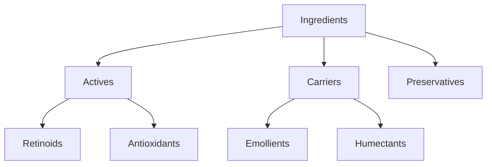
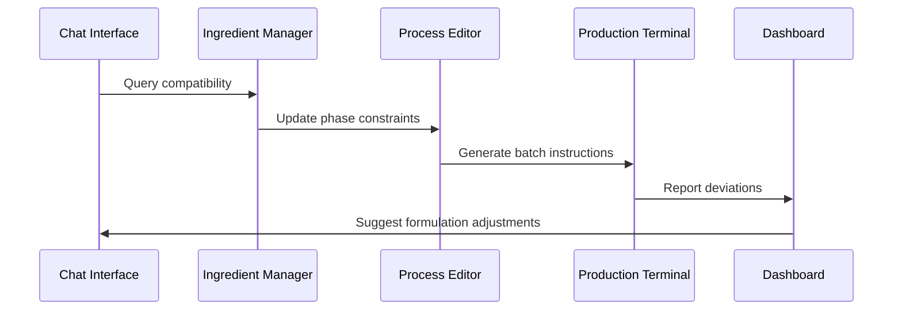

# Transforming Bolt Architecture for Skincare Formulation Development

The Bolt platform's existing architecture provides a robust foundation for developing a Chemistry Formulation Assistant tailored to skincare product development. By leveraging Bolt's core components while introducing domain-specific modifications, we can create a specialized system that addresses the unique requirements of cosmetic chemistry while maintaining GMP compliance and scientific rigor.

## Architectural Transformation Framework

### 1. Formulation Chat Interface Adaptation

**Base Component:** Bolt's AI chat interface
**Transformation Strategy:**

- Implement cosmetic chemistry-specific language models trained on:
    - Ingredient interaction databases (e.g., CosIng, PCPC)
    - Regulatory guidelines (FDA 21 CFR, EU Cosmetics Regulation)
    - Formulation science literature [^8][^19]
- Develop context-aware dialogue management:

```typescript
function handleFormulationQuery(query) {
  const context = getCurrentFormulationState();
  const safetyCheck = validateGMPCompliance(query, context);
  return generateResponse(query, context, safetyCheck);
}
```

- Integrate real-time stability prediction using QSPR models:
\$ StabilityScore = f(pH, HLB, IngredientCompatibility) \$ [^13][^18]

**Key Enhancements:**

- Phase-aware conversation context (oil/water/emulsion)
- Automatic TGA/INCI name validation [^10][^14]
- Preservative system efficacy calculator [^16][^19]


### 2. Digital Ingredient Manager Implementation

**Base Component:** Bolt's file system architecture
**Transformation Strategy:**

- Create hierarchical ingredient database:



- Implement smart metadata tagging:

```json
{
  "ingredient": "Niacinamide",
  "type": "Active",
  "solubility": "Water-soluble",
  "pH_range": [4.5, 7.0],
  "max_concentration": 5.0,
  "INCI": "Nicotinamide"
}
```

- Develop compatibility matrix visualization:
\$ C_{ij} = CompatibilityScore(Ingredient_i, Ingredient_j) \$ [^9][^13]

**Key Enhancements:**

- Real-time HLB value calculator [^8][^15]
- Phase separation early warning system [^13][^18]
- Regulatory status indicators per market region [^10][^14]


### 3. Process Editor Optimization

**Base Component:** Bolt's code editor
**Transformation Strategy:**

- Create visual process flow designer:

```python
class MixingProcess:
  def __init__(self, phases):
      self.phases = phases
      self.temperature_profile = []
  
  def add_phase(self, phase):
      self.phases.append(phase)
      self._update_temperature_profile()
```

- Implement parameter constraint system:
\$ T_{max} = f(IngredientStability, PhaseType) \$ [^8][^15]
- Develop time-temperature integration calculator:
\$ TTI = \int_{t_0}^{t} T(t)dt \$ [^13][^18]

**Key Enhancements:**

- Automated shear rate calculator for emulsification [^9][^15]
- pH adjustment simulation with buffer capacity modeling [^16][^19]
- Preservation efficacy time-staggering planner [^10][^14]


### 4. Production Terminal Enhancement

**Base Component:** Bolt's command terminal
**Transformation Strategy:**

- Develop batch record generator:

```typescript
function generateBatchRecord(formulation) {
  const steps = formulation.processes.map(p => 
    `${p.stepNumber}: ${p.instruction} @ ${p.temperature}°C`
  );
  return new BatchDocument(steps);
}
```

- Implement real-time parameter monitoring:

```python
class ProductionMonitor:
  def __init__(self, sensors):
      self.sensors = sensors
  
  def check_deviations(self):
      return [s for s in self.sensors if not s.in_spec]
```

- Create GMP-compliant audit trail:
\$ AuditLog = \bigcup_{t} (Action_t, Operator_t, Timestamp_t) \$ [^10][^17]

**Key Enhancements:**

- Scale-up factor calculator (Lab → Pilot → Production) [^15][^16]
- Cleaning validation protocol generator [^10][^14]
- Environmental monitoring integration [^13][^18]


### 5. Formulation Dashboard Development

**Base Component:** Bolt's project management interface
**Transformation Strategy:**

- Implement real-time specification monitoring:

```javascript
const specPanel = new DashboardPanel({
  metrics: ['pH', 'viscosity', 'preservative_activity'],
  alerts: [SpecAlertSystem]
});
```

- Develop stability prediction visualization:
\$ StabilityMap(t) = f(FormulationParams, StorageConditions) \$ [^13][^18]
- Create cost analysis engine:
\$ UnitCost = \sum (IngredientCost \times Concentration) + ProcessCost \$ [^16][^19]

**Key Enhancements:**

- Accelerated stability test simulator [^8][^15]
- Regulatory document assembler [^10][^14]
- Ecotoxicology impact estimator [^13][^18]


## System Integration Strategy

### Cross-Component Data Flow




### Key Integration Features

1. **Unified Version Control**
    - Formula iterations tracked as Git-like commits [^17][^22]
    - Differential analysis between formula versions [^16][^19]

```bash
git-formulation diff v1.2..v1.3 --ingredients
```

2. **Regulatory Compliance Engine**
    - Automated MoCRA documentation generator [^10][^14]
    - Real-time EU Annex II/III checks [^16][^19]
3. **AI-Powered Optimization**
    - Hyperparameter tuning for emulsion stability [^8][^15]
    - Preservation system neural designer [^13][^18]

## Technical Implementation Roadmap

### Phase 1: Core Architecture Adaptation (0-6 Months)

1. Modify Bolt's kernel for cosmetic chemistry operations [^15][^16]
2. Implement ingredient database schema [^9][^13]
3. Develop GMP-compliant audit trail system [^10][^17]

### Phase 2: Scientific Model Integration (6-12 Months)

1. Integrate QSPR stability predictors [^8][^18]
2. Deploy phase behavior simulation engine [^13][^15]
3. Implement preservative efficacy calculator [^16][^19]

### Phase 3: Production Scaling (12-18 Months)

1. Develop equipment-aware scale-up algorithms [^15][^16]
2. Implement cleaning validation protocols [^10][^14]
3. Create batch record templating system [^17][^22]

## Challenges and Mitigation Strategies

1. **Ingredient Interaction Complexity**
    - Solution: Implement hybrid ML/physical models [^8][^13][^18]
    - Validation: Partner with ISO 17025 labs for empirical testing
2. **Regulatory Variability**
    - Solution: Modular compliance engine [^10][^14]
    - Update Mechanism: Automated regulation monitoring API
3. **Scale-up Precision**
    - Solution: CFD-integrated mixing simulator [^15][^16]
    - Calibration: Pilot plant validation protocol

This transformation approach leverages Bolt's proven web-based architecture while introducing domain-specific innovations that address the unique requirements of skincare formulation development. The resulting system provides cosmetic chemists with an integrated environment that combines AI-driven formulation assistance with rigorous quality management and regulatory compliance features [^10][^14][^16][^19].

<div style="text-align: center">⁂</div>

[^1]: https://github.com/stackblitz-labs/bolt.diy

[^2]: https://github.com/stackblitz/bolt.new

[^3]: https://github.com/stackblitz-labs/bolt.diy

[^4]: https://github.com/stackblitz/bolt.new

[^5]: https://www.semanticscholar.org/paper/c9ac0e19e5664ebf80654f43f4c5e501f593123f

[^6]: https://thinktank.ottomator.ai/t/files-management-architecture/1969

[^7]: https://github.com/stackblitz/bolt.new

[^8]: https://stackblitz-labs.github.io/bolt.diy/

[^9]: https://www.youtube.com/watch?v=B_MikzCqS2c

[^10]: https://www.semanticscholar.org/paper/3f5e63168d0ae1af41c3434e9e3e7e84dda9a5d8

[^11]: https://arxiv.org/abs/2001.02514

[^12]: https://www.semanticscholar.org/paper/0499ec3b1af9a1bed50c58cc953f5c6830ad8264

[^13]: https://arxiv.org/abs/1712.01507

[^14]: https://www.semanticscholar.org/paper/ae9c6094a4f1556d2837c21f2e229e942d42b603

[^15]: https://www.semanticscholar.org/paper/696b9f3f2e5cb15301b17e6a8aff597353fc3eaa

[^16]: https://www.semanticscholar.org/paper/87b0ea27f3fb166a99c108bd82801f1125ea6d25

[^17]: https://arxiv.org/pdf/2110.15238.pdf

[^18]: https://arxiv.org/pdf/2303.17727.pdf

[^19]: https://arxiv.org/pdf/1807.06735.pdf

[^20]: https://arxiv.org/pdf/2205.11578.pdf

[^21]: https://arxiv.org/pdf/2305.12018.pdf

[^22]: https://arxiv.org/pdf/2301.00989.pdf

[^23]: http://arxiv.org/pdf/2407.09409.pdf

[^24]: http://arxiv.org/pdf/2107.10050.pdf

[^25]: https://arxiv.org/abs/2005.12775

[^26]: https://www.semanticscholar.org/paper/ba8dcc218ed86364208623c2d280089a7acefa4a

[^27]: https://arxiv.org/abs/2212.09062

[^28]: https://arxiv.org/html/2503.14445v1

[^29]: https://bolt.new

[^30]: https://github.com/stackblitz/bolt.new

[^31]: https://bolt.new/~/sb1-rz8ejghj

[^32]: https://refine.dev/blog/bolt-new-ai/

[^33]: https://www.sidetool.co/post/how-to-build-a-content-management-system-with-boltnew

[^34]: https://stackblitz-labs.github.io/bolt.diy/

[^35]: https://chromewebstore.google.com/detail/boltnew-snippets/mhnfoeilglpnboidckbaefhkdenklomg

[^36]: https://www.youtube.com/watch?v=aZn8PhqUZVU

[^37]: https://github.com/stackblitz-labs/bolt.diy

[^38]: https://www.abdulazizahwan.com/2025/03/bolt-diy-the-ultimate-guide-to-ai-powered-full-stack-web-development.html

[^39]: https://www.youtube.com/watch?v=EJvCiwdAU3U

[^40]: https://github.com/stackblitz-labs/bolt.diy/issues/1305

[^41]: https://www.youtube.com/watch?v=wUi7PvpCuNY

[^42]: https://www.youtube.com/watch?v=6cHR9_D8xv4

[^43]: https://www.youtube.com/watch?v=bIc_p8i88g0

[^44]: https://www.reddit.com/r/boltnewbuilders/comments/1irgvpo/i_built_a_free_chrome_extension_for_bolt_thats/

[^45]: https://www.linkedin.com/posts/mohammed-mahboob-7361b966_boltnew-ai-coding-tool-for-architecture-activity-7267648644202258434-gceB

[^46]: https://thinktank.ottomator.ai/t/everything-you-need-to-get-started-with-bolt-diy/2741

[^47]: https://chromewebstore.google.com/detail/bolt-to-github/pikdepbilbnnpgdkdaaoeekgflljmame

[^48]: https://packagist.org/search/?query=mqtt\&type=bolt-extension

[^49]: https://www.ncbi.nlm.nih.gov/pmc/articles/PMC9692311/

[^50]: https://www.semanticscholar.org/paper/ee177faa39b981d6dd21994ac33269f3298e3f68

[^51]: https://www.youtube.com/watch?v=B_MikzCqS2c

[^52]: https://stackblitz-labs.github.io/bolt.diy/FAQ/

[^53]: https://www.reddit.com/r/boltnewbuilders/comments/1ivrzrg/any_way_to_build_or_use_external_apis_with_boltdiy/

[^54]: https://github.com/stackblitz-labs/bolt.diy/activity

[^55]: https://puppet.com/docs/bolt/latest/using_plugins.html

[^56]: https://repocloud.io/boltdiy

[^57]: https://www.youtube.com/watch?v=0_Ij8FEvY4U

[^58]: https://www.linkedin.com/posts/oleg-seifert-47692373_github-stackblitz-labsboltdiy-prompt-activity-7286013510772219906-iubh

[^59]: https://www.youtube.com/watch?v=hISxKxKbEsE

[^60]: https://github.com/stackblitz/bolt.new/issues/5019

[^61]: https://www.reddit.com/r/boltnewbuilders/comments/1jymxr4/help_needed_setting_up_boltnew_for_a_modular_team/

[^62]: https://help.bolt.com/developers/apis/

[^63]: https://github.com/stackblitz/bolt.new/issues/10196

[^64]: https://www.reddit.com/r/boltnewbuilders/comments/1j4glq1/bolt_for_apis/

[^65]: https://github.com/stackblitz/bolt.new/issues/8954

[^66]: https://support.bolt.new/building/getting-started

[^67]: https://help.bolt.com/api-bolt/

[^68]: https://www.semanticscholar.org/paper/bf9134c592d66e5ea4b34a4b377a55718cb51d35

[^69]: https://www.semanticscholar.org/paper/e9de908dce338f52be8b120f68a0a86e629850fd

[^70]: https://www.youtube.com/watch?v=ultG9pNAO1k

[^71]: https://thinktank.ottomator.ai/t/enhancing-bolt-diy-local-database-authentication-and-webcontainer-improvements/5332

[^72]: https://thinktank.ottomator.ai/t/can-i-use-bolt-diy-to-modify-add-on-to-a-project-i-started-in-vs-code-using-cline/2881

[^73]: https://www.codebolt.ai

[^74]: https://github.com/stackblitz-labs/bolt.diy/issues/885

[^75]: https://www.youtube.com/watch?v=Mdx0Rj4TJBU

[^76]: https://www.youtube.com/watch?v=tTiLg8eYkP0

[^77]: https://www.youtube.com/watch?v=GIafyFXvZmY

[^78]: https://github.com/stackblitz-labs/bolt.diy/issues/594

[^79]: https://selfhostedworld.com/software/bolt-diy

[^80]: https://support.bolt.new/building/using-bolt

[^81]: https://www.semanticscholar.org/paper/da5951e74e0ce636839a5552e46f34d90ed58fc5

[^82]: https://www.semanticscholar.org/paper/13c1bbf92f7c3c6c747c7d9c944786c593ac1d47

[^83]: https://www.semanticscholar.org/paper/236d4f6db48fd7dc0b39c0084e299e047154c16f

[^84]: https://www.semanticscholar.org/paper/88b9ecffdcccb9bc6651d9f35c32b06ce012feac

[^85]: https://arxiv.org/abs/2205.02302

[^86]: https://www.semanticscholar.org/paper/1dde2de96041c9018dc15014336353051a922e64

[^87]: https://www.semanticscholar.org/paper/4e48b99c4294370da72cd605b99adb024a84ad68

[^88]: https://arxiv.org/abs/2202.08455

[^89]: https://railway.com/template/abVHie

[^90]: https://github.com/startnow0/bolt.diy

[^91]: https://github.com/stackblitz/bolt.new/issues/6615

[^92]: https://github.com/stackblitz/bolt.new/issues/534

[^93]: https://github.com/stackblitz/bolt.new/issues/9128

[^94]: https://github.com/stackblitz/bolt.new/issues/9180

[^95]: https://thinktank.ottomator.ai/t/files-management-architecture/1969

[^96]: https://www.youtube.com/watch?v=9V3tQedTUDk

[^97]: https://www.ncbi.nlm.nih.gov/pmc/articles/PMC11223827/

[^98]: https://arxiv.org/abs/2405.13177

[^99]: https://arxiv.org/abs/2405.00823

[^100]: https://www.semanticscholar.org/paper/26ff459c9217d7cdc13da0ca72fe70f7b430c44a

[^101]: https://pubmed.ncbi.nlm.nih.gov/37117022/

[^102]: https://www.semanticscholar.org/paper/f72462695419407c444f9320cb3d7b08e3901a25

[^103]: https://www.ncbi.nlm.nih.gov/pmc/articles/PMC9056036/

[^104]: https://www.ncbi.nlm.nih.gov/pmc/articles/PMC6602445/

[^105]: https://www.reddit.com/r/DIY/comments/zynyn7/building_a_work_bench_wood_screws_or_lag_bolts/

[^106]: https://www.instructables.com/How-to-build-a-sturdy-workbench-inexpensively/

[^107]: https://www.youtube.com/watch?v=Q4AcJbPxrwA

[^108]: https://www.youtube.com/watch?v=knLe8zzwNRA

