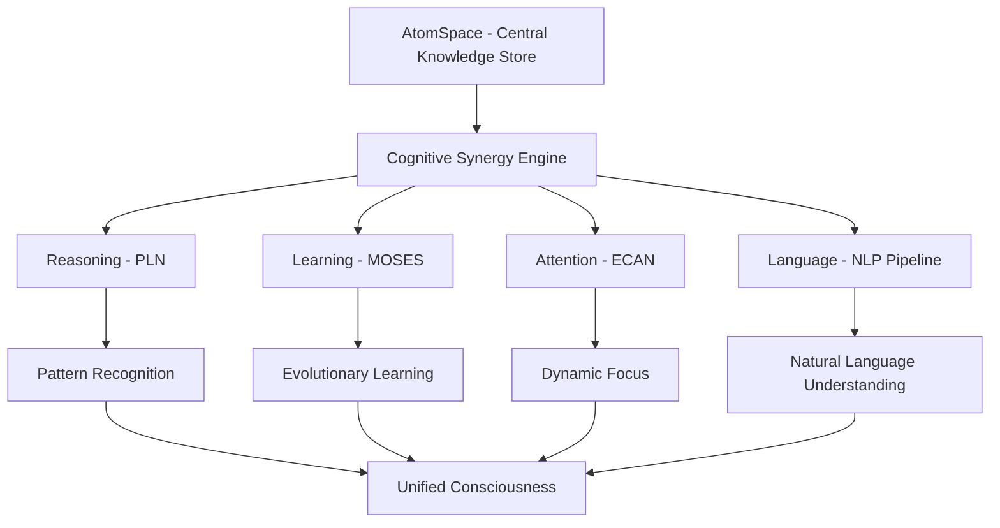
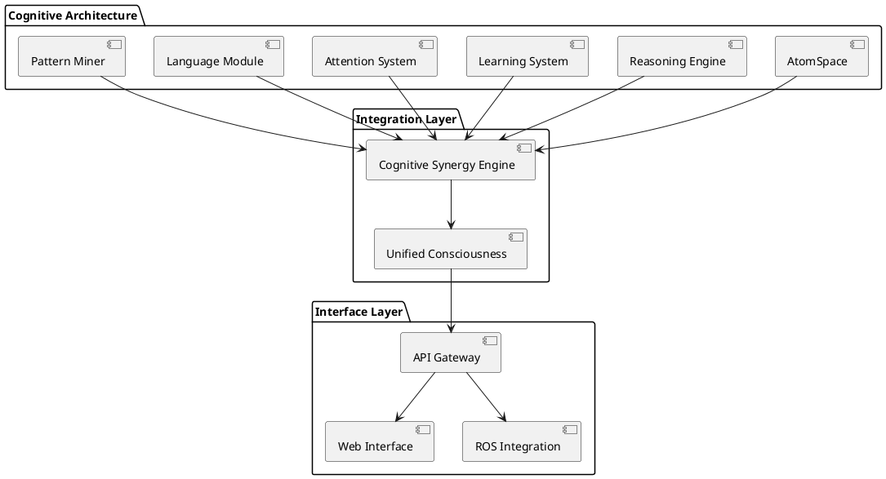

# Cognitive Architecture

## Overview

OpenCog implements a comprehensive cognitive architecture based on the CogPrime design, featuring:

- **Hypergraph Knowledge Representation**: AtomSpace as central knowledge store
- **Ontogenetic Development**: 10-layer developmental progression
- **Cognitive Synergy**: Integrated reasoning, learning, and perception
- **Embodied Intelligence**: Sensorimotor integration capabilities

## CogPrime Architecture



### Core Components Status

| Component | Status | Completeness | Notes |
|-----------|--------|--------------|-------|
| AtomSpace | ✅ Active | 95% | Stable hypergraph database |
| PLN (Reasoning) | ✅ Active | 80% | Probabilistic logic networks |
| MOSES (Learning) | ✅ Active | 85% | Evolutionary program synthesis |
| ECAN (Attention) | ✅ Active | 75% | Economic attention networks |
| NLP Pipeline | ✅ Active | 70% | Natural language processing |
| Pattern Miner | ✅ Active | 85% | Frequent pattern mining |
| Ghost (Chatbot) | ✅ Active | 90% | Dialog system |

## Ontogenetic Development Layers

The system follows a 10-layer ontogenetic progression:

### Layer 0: Packaging & Deployment
```scheme
(define-module (ontogenesis deployment-genesis)
  #:use-module (opencog)
  #:export (initialize-deployment))
```
**Status**: ✅ Complete - Basic deployment infrastructure

### Layer 1: Foundation - Cognitive Kernel
```scheme
(define-module (ontogenesis cognitive-kernel-genesis)
  #:use-module (opencog)
  #:export (genesis-cognitive-kernel))
```
**Status**: ✅ Complete - Core atomspace operations

### Layer 2: Core - Hypergraph Substrate
```scheme
(define-module (ontogenesis hypergraph-substrate)
  #:use-module (opencog atomspace)
  #:export (materialize-hypergraph-substrate))
```
**Status**: ✅ Complete - Advanced hypergraph operations

### Layer 3: Logic - Reasoning Engine
```scheme
(define-module (ontogenesis reasoning-engine)
  #:use-module (opencog pln)
  #:export (implement-reasoning-engine))
```
**Status**: 🔄 Active Development - PLN integration

### Layer 4: Cognitive - Attention Dynamics
```scheme
(define-module (ontogenesis attention-dynamics)
  #:use-module (opencog attention)
  #:export (integrate-attention-dynamics))
```
**Status**: 🔄 Active Development - ECAN improvements

### Layer 5: Advanced - Pattern Recognition
```scheme
(define-module (ontogenesis pattern-recognition)
  #:use-module (opencog miner)
  #:export (recognize-emergent-patterns))
```
**Status**: 🔄 Active Development - Advanced pattern mining

### Layer 6: Learning - Adaptive Intelligence
```scheme
(define-module (ontogenesis adaptive-intelligence)
  #:use-module (opencog moses)
  #:export (activate-adaptive-intelligence))
```
**Status**: 🔄 Active Development - MOSES integration

### Layer 7: Language - Natural Language Cognition
```scheme
(define-module (ontogenesis language-cognition)
  #:use-module (opencog nlp)
  #:export (enable-natural-language))
```
**Status**: 🔄 Active Development - NLP pipeline

### Layer 8: Embodiment - Sensorimotor Integration
```scheme
(define-module (ontogenesis sensorimotor)
  #:use-module (opencog embodiment)
  #:export (integrate-sensorimotor))
```
**Status**: ⚠️ Experimental - Robotics integration

### Layer 9: Integration - Unified Consciousness
```scheme
(define-module (ontogenesis unified-consciousness)
  #:use-module (opencog)
  #:export (unify-consciousness))
```
**Status**: 🔬 Research Phase - Meta-cognitive integration

## Cognitive Synergy Principles

### 1. Multi-Modal Integration
- **Text Processing**: Link Grammar, RelEx
- **Visual Processing**: Computer vision integration
- **Audio Processing**: Speech recognition/synthesis
- **Motor Control**: Robotics frameworks

### 2. Dynamic Knowledge Representation
- **Atoms**: Immutable knowledge elements
- **Values**: Mutable streaming data
- **TruthValues**: Probabilistic beliefs
- **AttentionValues**: Dynamic importance weighting

### 3. Emergent Intelligence
- **Bottom-up Processing**: Pattern emergence from data
- **Top-down Processing**: Goal-directed reasoning
- **Lateral Processing**: Cross-modal associations
- **Meta-Processing**: Self-reflective cognition

## Implementation Architecture



## Key Research Areas

### Current Focus
1. **Neural-Symbolic Integration**: Bridging neural networks with symbolic reasoning
2. **Scalable Inference**: Efficient reasoning on large knowledge bases
3. **Continuous Learning**: Online adaptation and knowledge acquisition
4. **Meta-Cognition**: Self-reflective and self-improving systems

### Future Directions
1. **Quantum Computing Integration**: Quantum-enhanced reasoning
2. **Distributed Cognition**: Multi-agent cognitive systems
3. **Biologically-Inspired Architectures**: Neural substrate modeling
4. **Consciousness Modeling**: Integrated information theory implementation

## Performance Characteristics

| Metric | Current | Target | Notes |
|--------|---------|--------|-------|
| Atoms/sec | 100K | 1M | Knowledge insertion rate |
| Inferences/sec | 1K | 10K | Reasoning throughput |
| Memory Usage | 1-10GB | Scalable | Working set size |
| Response Time | 100ms | 10ms | Interactive response |
| Concurrent Users | 10 | 1000 | Multi-user support |

## Integration Patterns

### AtomSpace as Central Hub
```scheme
;; Example: Creating cognitive integration
(define cognitive-state
  (EvaluationLink
    (PredicateNode "cognitive-state")
    (ListLink
      (ConceptNode "reasoning-active")
      (ConceptNode "learning-enabled")
      (ConceptNode "attention-focused"))))
```

### Cross-Module Communication
```python
# Python example: AI/ML integration
from opencog.atomspace import AtomSpace, TruthValue
from opencog.type_constructors import *

# Create integrated cognitive pipeline
def process_cognitive_input(input_data):
    # Neural processing
    neural_output = neural_network.process(input_data)
    
    # Symbolic representation
    concept = ConceptNode(input_data['concept'])
    atomspace.add_atom(concept)
    
    # Reasoning integration
    inference_result = pln_reasoner.infer(concept)
    
    return {
        'neural': neural_output,
        'symbolic': concept,
        'inference': inference_result
    }
```

## Next Steps

### Immediate (0-3 months)
- [ ] Complete Layer 3-4 integration
- [ ] Enhance PLN performance
- [ ] Improve ECAN algorithms
- [ ] Expand neural-symbolic bridges

### Short-term (3-6 months)
- [ ] Implement Layer 5-6 capabilities
- [ ] Advanced pattern recognition
- [ ] Continuous learning systems
- [ ] Real-time processing optimization

### Medium-term (6-12 months)
- [ ] Complete Layer 7-8 integration
- [ ] Full NLP pipeline
- [ ] Embodied intelligence
- [ ] Multi-modal processing

### Long-term (1+ years)
- [ ] Unified consciousness model
- [ ] Meta-cognitive capabilities
- [ ] Distributed cognition
- [ ] AGI milestone achievements
