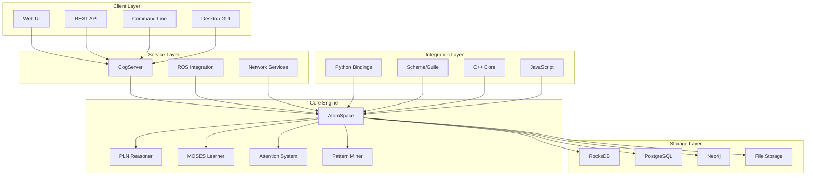
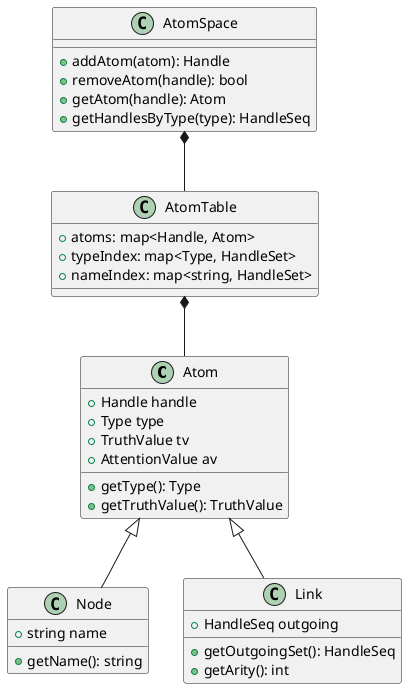
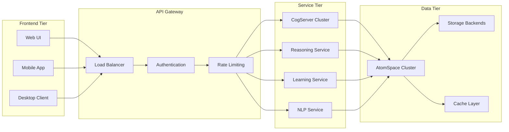
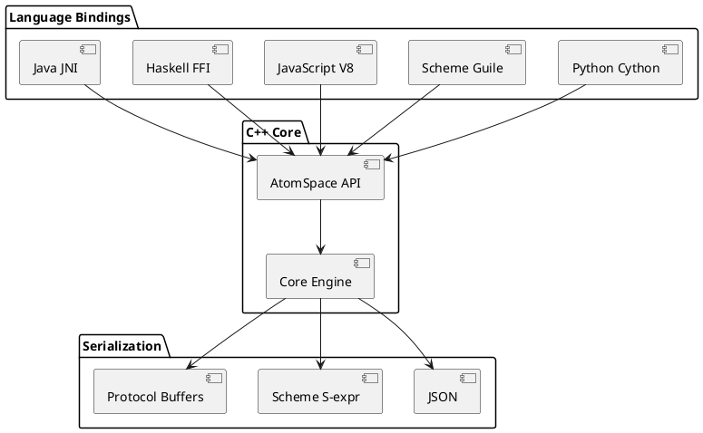
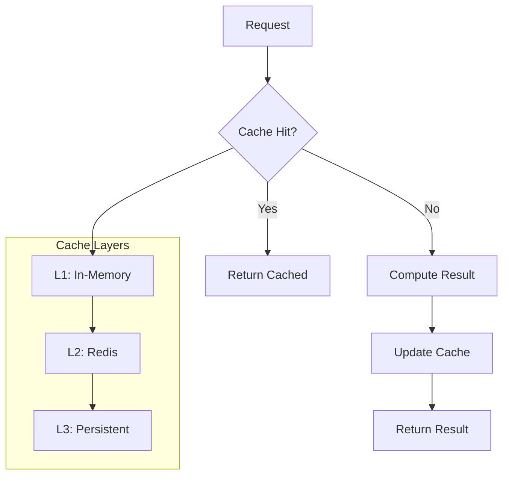
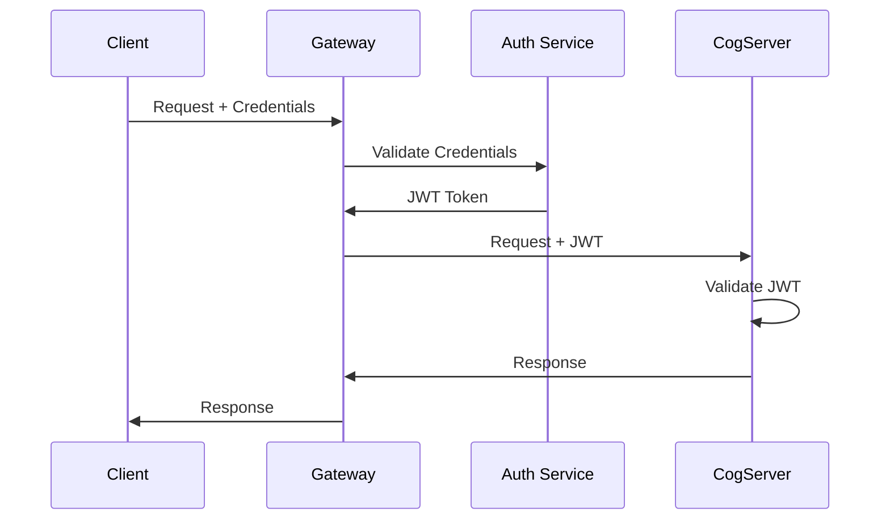

# Technical Architecture

## System Overview

OpenCog implements a distributed, modular architecture centered around the AtomSpace hypergraph database. The system supports multiple programming languages, deployment environments, and integration patterns.

## Core Architecture



## AtomSpace Architecture

### Hypergraph Database Design



### Key Features

1. **Immutable Atoms**: Core knowledge elements that never change
2. **Mutable Values**: Streaming data attached to atoms
3. **Type System**: Hierarchical type inheritance
4. **Pattern Matching**: Sophisticated query engine
5. **Persistence**: Multiple storage backends

## Component Architecture

### 1. CogServer - Central Hub

**Purpose**: Network-accessible cognitive server
**Status**: ✅ Production Ready
**Languages**: C++, Python, Scheme

```cpp
// C++ CogServer module interface
class Module {
public:
    virtual void init() = 0;
    virtual std::string do_command(const std::string& cmd) = 0;
};

class CogServerModule : public Module {
    AtomSpace* _atomspace;
    NetworkServer* _server;
public:
    void init() override;
    std::string do_command(const std::string& cmd) override;
};
```

### 2. AtomSpace - Knowledge Store

**Purpose**: Central hypergraph database
**Status**: ✅ Production Ready
**Performance**: 100K+ atoms/second insertion

```scheme
;; Scheme AtomSpace operations
(use-modules (opencog))

;; Create knowledge
(ConceptNode "OpenCog")
(EvaluationLink
  (PredicateNode "is-a")
  (ListLink
    (ConceptNode "OpenCog")
    (ConceptNode "AGI-System")))

;; Query knowledge
(cog-bind
  (BindLink
    (VariableNode "$x")
    (EvaluationLink
      (PredicateNode "is-a")
      (ListLink
        (VariableNode "$x")
        (ConceptNode "AGI-System")))
    (VariableNode "$x")))
```

### 3. PLN - Probabilistic Logic Networks

**Purpose**: Uncertain reasoning engine
**Status**: 🔄 Active Development
**Capabilities**: Forward/backward chaining, uncertainty handling

```python
# Python PLN usage
from opencog.pln import *
from opencog.atomspace import AtomSpace

# Create reasoning chain
atomspace = AtomSpace()
chainer = BackwardChainer(atomspace)

# Add inference rules
chainer.add_rule(DeductionRule())
chainer.add_rule(ModusPonensRule())

# Execute reasoning
target = ConceptNode("human")
result = chainer.do_chain(target, focus_set)
```

### 4. MOSES - Evolutionary Learning

**Purpose**: Program synthesis and optimization
**Status**: ✅ Production Ready
**Applications**: Feature selection, model evolution

```python
# MOSES integration example
from opencog.moses import *

# Create MOSES instance
moses = MOSES()

# Define fitness function
def fitness_function(program, dataset):
    return accuracy_score(program.evaluate(dataset))

# Evolve programs
moses.set_fitness_function(fitness_function)
best_program = moses.run(max_evals=10000)
```

### 5. Pattern Miner

**Purpose**: Frequent pattern discovery
**Status**: ✅ Production Ready
**Algorithms**: Frequent subgraph mining

```scheme
;; Pattern mining configuration
(use-modules (opencog miner))

(Inheritance "pattern-miner-mode" "Surprisingness")
(Inheritance "pattern-miner-conjunction-expansion" "true")

;; Mine patterns
(cog-mine
  (ConceptNode "dataset")
  #:minsup 5
  #:maximum-iterations 100)
```

## Storage & Persistence

### Supported Backends

| Backend | Status | Use Case | Performance |
|---------|--------|----------|-------------|
| RocksDB | ✅ Stable | High-performance | 100K+ ops/sec |
| PostgreSQL | ✅ Stable | ACID compliance | 10K ops/sec |
| Neo4j | 🔄 Experimental | Graph analytics | Variable |
| File | ✅ Stable | Development/testing | 1K ops/sec |
| DHT | 🔬 Research | Distributed | Variable |
| IPFS | 🔬 Research | Decentralized | Variable |

### Configuration Example

```scheme
;; Storage configuration
(use-modules (opencog persist-rocks))

;; Open RocksDB storage
(rocks-open "file:///tmp/opencog.rdb")

;; Store atoms
(store-atom (ConceptNode "persistent-concept"))

;; Load atoms
(load-atomspace)
```

## Network Architecture

### Service Topology



### RESTful API Design

```yaml
# OpenAPI specification excerpt
paths:
  /atomspace/atoms:
    get:
      summary: List atoms
      parameters:
        - name: type
          in: query
          schema:
            type: string
    post:
      summary: Create atom
      requestBody:
        content:
          application/json:
            schema:
              $ref: '#/components/schemas/Atom'
  
  /reasoning/infer:
    post:
      summary: Execute inference
      requestBody:
        content:
          application/json:
            schema:
              type: object
              properties:
                target:
                  $ref: '#/components/schemas/Atom'
                rules:
                  type: array
                  items:
                    type: string
```

## Integration Patterns

### Language Bindings Architecture



### Plugin Architecture

```cpp
// Plugin interface definition
class PluginInterface {
public:
    virtual ~PluginInterface() = default;
    virtual bool initialize(AtomSpace* atomspace) = 0;
    virtual std::string get_name() const = 0;
    virtual std::string get_version() const = 0;
};

// Example plugin implementation
class CustomReasoningPlugin : public PluginInterface {
public:
    bool initialize(AtomSpace* atomspace) override {
        _atomspace = atomspace;
        register_reasoning_rules();
        return true;
    }
    
    std::string get_name() const override {
        return "CustomReasoning";
    }
};
```

## Performance Optimization

### Memory Management

```cpp
// High-performance atom creation
class AtomFactory {
    std::vector<std::unique_ptr<Atom>> _atom_pool;
    std::queue<Atom*> _free_atoms;
    
public:
    Atom* create_atom(Type type) {
        if (_free_atoms.empty()) {
            expand_pool();
        }
        Atom* atom = _free_atoms.front();
        _free_atoms.pop();
        atom->reset(type);
        return atom;
    }
};
```

### Concurrent Processing

```cpp
// Thread-safe AtomSpace operations
class ThreadSafeAtomSpace {
    std::shared_mutex _mutex;
    AtomSpace _atomspace;
    
public:
    Handle add_atom(const Atom& atom) {
        std::unique_lock lock(_mutex);
        return _atomspace.add_atom(atom);
    }
    
    Atom get_atom(Handle h) const {
        std::shared_lock lock(_mutex);
        return _atomspace.get_atom(h);
    }
};
```

### Caching Strategy



## Deployment Architecture

### Container Orchestration

```yaml
# Kubernetes deployment
apiVersion: apps/v1
kind: Deployment
metadata:
  name: cogserver
spec:
  replicas: 3
  selector:
    matchLabels:
      app: cogserver
  template:
    metadata:
      labels:
        app: cogserver
    spec:
      containers:
      - name: cogserver
        image: opencog/cogserver:latest
        ports:
        - containerPort: 17001
        env:
        - name: ATOMSPACE_STORAGE
          value: "rocksdb"
        resources:
          requests:
            memory: "2Gi"
            cpu: "1"
          limits:
            memory: "4Gi"
            cpu: "2"
```

### Monitoring & Observability

```yaml
# Prometheus monitoring
apiVersion: v1
kind: ConfigMap
metadata:
  name: opencog-metrics
data:
  prometheus.yml: |
    global:
      scrape_interval: 15s
    scrape_configs:
    - job_name: 'cogserver'
      static_configs:
      - targets: ['cogserver:17001']
      metrics_path: /metrics
```

## Security Architecture

### Authentication Flow



### Access Control

```python
# Role-based access control
class AtomSpaceACL:
    def __init__(self):
        self.permissions = {
            'admin': ['read', 'write', 'delete', 'execute'],
            'user': ['read', 'write'],
            'guest': ['read']
        }
    
    def check_permission(self, user_role, operation, atom):
        return operation in self.permissions.get(user_role, [])
```

## Development Workflow

### Build System

```cmake
# CMake configuration excerpt
find_package(AtomSpace REQUIRED)
find_package(CogUtil REQUIRED)
find_package(Boost REQUIRED COMPONENTS system filesystem)

add_executable(cognitive_app
    src/main.cpp
    src/reasoning.cpp
    src/learning.cpp
)

target_link_libraries(cognitive_app
    ${ATOMSPACE_LIBRARIES}
    ${COGUTIL_LIBRARIES}
    ${Boost_LIBRARIES}
)
```

### Testing Framework

```cpp
// Unit test example
#include <cxxtest/TestSuite.h>
#include <opencog/atomspace/AtomSpace.h>

class AtomSpaceTest : public CxxTest::TestSuite {
public:
    void test_atom_creation() {
        AtomSpace as;
        Handle h = as.add_node(CONCEPT_NODE, "test");
        TS_ASSERT(h != Handle::UNDEFINED);
        TS_ASSERT_EQUALS(as.get_name(h), "test");
    }
};
```

## Next Steps

### Immediate Technical Priorities

1. **Performance Optimization**
   - [ ] Improve AtomSpace concurrent access
   - [ ] Optimize pattern matching algorithms
   - [ ] Enhance memory management

2. **Scalability Improvements**
   - [ ] Distributed AtomSpace implementation
   - [ ] Horizontal scaling support
   - [ ] Load balancing optimization

3. **Integration Enhancements**
   - [ ] Modern web framework integration
   - [ ] Cloud-native architecture
   - [ ] Microservices decomposition

4. **Developer Experience**
   - [ ] Improved debugging tools
   - [ ] Better documentation
   - [ ] Enhanced IDE support
