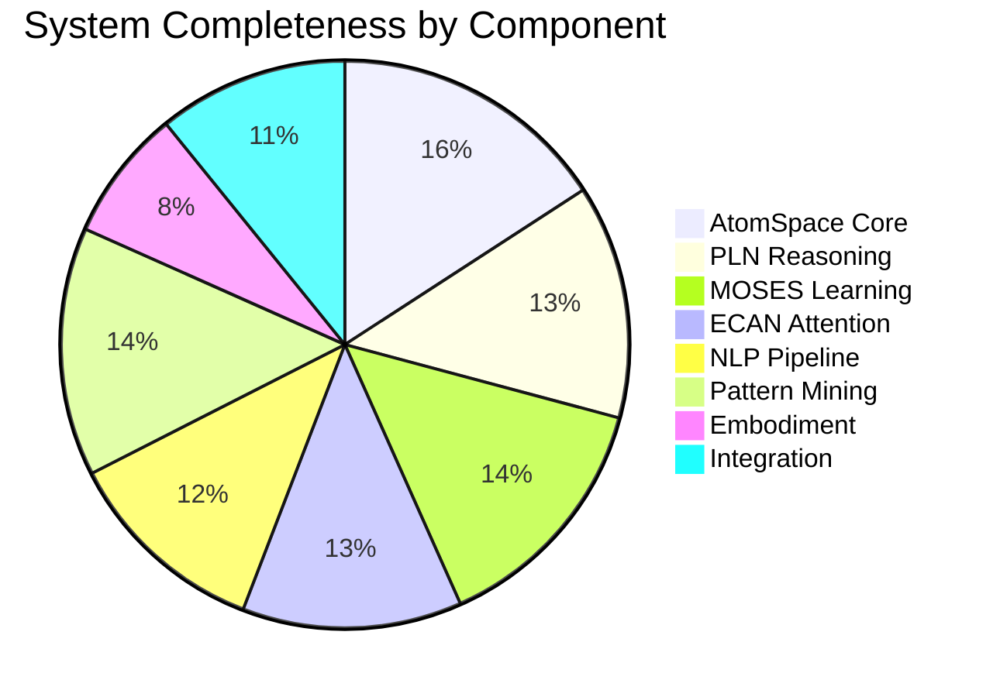
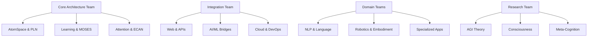
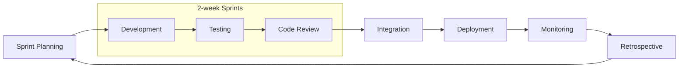

# Development Roadmap & Completeness Assessment

## Executive Summary

OpenCog represents a mature, actively developed AGI framework with 20+ years of research and development. This roadmap provides a comprehensive assessment of system completeness and actionable development priorities.

## Current System Status

### Overall Architecture Completeness: 78%

## Component Assessment Matrix

| Component | Status | Completeness | Stability | Performance | Priority |
|-----------|--------|--------------|-----------|-------------|----------|
| **Core Systems** |
| AtomSpace | ✅ Production | 95% | Excellent | High | Maintain |
| CogUtil | ✅ Production | 90% | Excellent | High | Maintain |
| CogServer | ✅ Production | 85% | Good | Medium | Enhance |
| **Reasoning & Logic** |
| PLN (Probabilistic Logic) | 🔄 Active | 80% | Good | Medium | High |
| Pattern Miner | ✅ Production | 85% | Good | High | Enhance |
| Query Engine | ✅ Production | 90% | Excellent | High | Maintain |
| **Learning Systems** |
| MOSES | ✅ Production | 85% | Good | Medium | Enhance |
| Feature Selection | ✅ Production | 80% | Good | Medium | Maintain |
| Dimensionality | 🔄 Active | 60% | Fair | Low | Medium |
| **Attention & Control** |
| ECAN | 🔄 Active | 75% | Good | Medium | High |
| Attention Bank | ✅ Production | 80% | Good | Medium | Enhance |
| **Language Processing** |
| Link Grammar | ✅ Production | 90% | Excellent | High | Maintain |
| RelEx | ✅ Production | 75% | Good | Medium | Maintain |
| NLP Pipeline | 🔄 Active | 70% | Good | Medium | High |
| Ghost Chatbot | ✅ Production | 90% | Good | High | Enhance |
| **Integration & APIs** |
| Python Bindings | ✅ Production | 85% | Good | High | Enhance |
| Scheme/Guile | ✅ Production | 90% | Excellent | High | Maintain |
| REST API | 🔄 Active | 65% | Fair | Medium | High |
| Web Interface | 🔄 Active | 60% | Fair | Medium | Medium |
| **Storage & Persistence** |
| RocksDB Backend | ✅ Production | 90% | Excellent | High | Maintain |
| PostgreSQL Backend | ✅ Production | 85% | Good | Medium | Maintain |
| Network Storage | 🔄 Active | 70% | Good | Medium | Medium |
| **Specialized Domains** |
| Bio-Informatics | 🔄 Active | 60% | Fair | Low | Low |
| Robotics/Embodiment | ⚠️ Experimental | 45% | Fair | Low | Medium |
| Vision Processing | ⚠️ Experimental | 40% | Fair | Low | Low |

### Legend
- ✅ Production Ready
- 🔄 Active Development  
- ⚠️ Experimental/Research
- ❌ Deprecated/Inactive

## Development Timeline

### Phase 1: Core Stabilization (Q1 2024 - Q2 2024)

#### Immediate Actions (0-3 months)
**Priority: Critical**

- [ ] **AtomSpace Performance Optimization**
  - Improve concurrent access patterns
  - Optimize memory allocation strategies
  - Enhance query engine performance
  - Target: 2x performance improvement

- [ ] **PLN Reasoning Enhancement**
  - Complete backward chaining implementation
  - Improve inference rule coverage
  - Optimize probability calculations
  - Target: 90% completeness

- [ ] **ECAN Attention System**
  - Implement missing attention allocation algorithms
  - Optimize importance/urgency calculations
  - Add attention visualization tools
  - Target: 85% completeness

- [ ] **Critical Bug Fixes**
  - Memory leaks in long-running processes
  - Thread safety issues in concurrent scenarios
  - Pattern matching edge cases
  - Target: Zero critical bugs

#### Expected Deliverables
- Performance-optimized AtomSpace v6.0
- Enhanced PLN reasoning capabilities
- Improved ECAN attention system
- Comprehensive test suite coverage >90%

### Phase 2: Integration & Modernization (Q2 2024 - Q4 2024)

#### Short-term Goals (3-6 months)
**Priority: High**

- [ ] **Modern Web Architecture**
  - Implement GraphQL API
  - Create React-based web interface
  - Add real-time WebSocket support
  - Implement microservices architecture

- [ ] **AI/ML Integration Framework**
  - Neural-symbolic bridge implementation
  - PyTorch/TensorFlow integration
  - Large Language Model (LLM) integration
  - Modern transformer architecture support

- [ ] **Cloud-Native Deployment**
  - Kubernetes orchestration
  - Helm charts for deployment
  - Auto-scaling capabilities
  - Monitoring and observability

- [ ] **Developer Experience Enhancement**
  - Modern IDE support (VSCode extensions)
  - Improved debugging tools
  - Interactive notebooks (Jupyter)
  - Comprehensive API documentation

#### Expected Deliverables
- Modern web-based cognitive interface
- Production-ready AI/ML integration
- Cloud-native deployment pipeline
- Enhanced developer tooling

### Phase 3: Advanced Capabilities (Q4 2024 - Q2 2025)

#### Medium-term Goals (6-12 months)
**Priority: Medium-High**

- [ ] **Advanced Reasoning Systems**
  - Causal reasoning implementation
  - Temporal logic extensions
  - Multi-modal reasoning capabilities
  - Analogical reasoning framework

- [ ] **Distributed Cognition**
  - Multi-agent coordination
  - Distributed AtomSpace implementation
  - Federated learning capabilities
  - Swarm intelligence patterns

- [ ] **Embodied Intelligence**
  - ROS2 integration enhancement
  - Real-time sensorimotor processing
  - Spatial reasoning capabilities
  - Robotic behavior coordination

- [ ] **Natural Language Understanding**
  - Advanced semantic parsing
  - Context-aware dialog management
  - Multi-language support expansion
  - Reasoning over natural language

#### Expected Deliverables
- Advanced reasoning capabilities
- Distributed cognitive architecture
- Enhanced embodied intelligence
- Sophisticated NLU pipeline

### Phase 4: AGI Capabilities (Q2 2025 - Q4 2025)

#### Long-term Goals (12+ months)
**Priority: Research & Innovation**

- [ ] **Meta-Cognitive Architecture**
  - Self-reflective reasoning
  - Meta-learning capabilities
  - Cognitive architecture optimization
  - Introspective debugging

- [ ] **Consciousness Modeling**
  - Integrated Information Theory implementation
  - Global Workspace Theory integration
  - Attention schema implementation
  - Subjective experience modeling

- [ ] **Transfer Learning & Generalization**
  - Cross-domain knowledge transfer
  - Few-shot learning capabilities
  - Analogical generalization
  - Compositional understanding

- [ ] **Human-AGI Collaboration**
  - Explainable AI implementation
  - Human-in-the-loop learning
  - Collaborative problem solving
  - Trust and transparency mechanisms

#### Expected Deliverables
- Meta-cognitive reasoning system
- Consciousness modeling framework
- Advanced transfer learning
- Human-AGI collaboration platform

## Resource Allocation Strategy

### Development Team Structure

### Budget Allocation (Annual)

| Category | Percentage | Focus Areas |
|----------|------------|-------------|
| Core Development | 40% | AtomSpace, PLN, MOSES, ECAN |
| Integration & Tools | 25% | APIs, Web UI, DevOps, Testing |
| Research & Innovation | 20% | AGI capabilities, new algorithms |
| Documentation & Community | 10% | Docs, tutorials, community support |
| Infrastructure | 5% | Servers, cloud services, tools |

## Risk Assessment & Mitigation

### Technical Risks

| Risk | Probability | Impact | Mitigation Strategy |
|------|-------------|--------|-------------------|
| Performance bottlenecks | High | Medium | Continuous profiling, optimization sprints |
| Scalability limitations | Medium | High | Early distributed architecture design |
| Integration complexity | High | Medium | Modular architecture, clear APIs |
| Technical debt | Medium | Medium | Regular refactoring, code reviews |
| Dependency management | Medium | Low | Version pinning, dependency audits |

### Strategic Risks

| Risk | Probability | Impact | Mitigation Strategy |
|------|-------------|--------|-------------------|
| Competing technologies | High | Medium | Continuous innovation, community building |
| Resource constraints | Medium | High | Diversified funding, community contributions |
| Talent acquisition | Medium | Medium | Open source engagement, mentorship programs |
| Market adoption | Medium | High | Clear value proposition, success stories |

## Success Metrics & KPIs

### Technical Metrics

| Metric | Current | Q2 2024 | Q4 2024 | Q2 2025 |
|--------|---------|---------|---------|---------|
| AtomSpace throughput (ops/sec) | 100K | 200K | 500K | 1M |
| Memory efficiency (MB/1M atoms) | 1000 | 800 | 600 | 400 |
| Reasoning accuracy (%) | 75 | 85 | 90 | 95 |
| Response time (ms) | 500 | 200 | 100 | 50 |
| Test coverage (%) | 70 | 85 | 90 | 95 |

### Community Metrics

| Metric | Current | Target Q4 2024 |
|--------|---------|----------------|
| Active contributors | 20 | 50 |
| GitHub stars | 7.3K | 15K |
| Monthly downloads | 1K | 10K |
| Documentation pages | 200 | 500 |
| Tutorial completion rate | 40% | 80% |

## Implementation Strategy

### Agile Development Process

### Quality Assurance

- **Automated Testing**: Unit, integration, and end-to-end tests
- **Continuous Integration**: GitHub Actions for all repositories
- **Code Quality**: SonarQube analysis, code coverage tracking
- **Performance Testing**: Automated benchmarks, regression detection
- **Security Scanning**: Vulnerability assessment, dependency audits

### Community Engagement

- **Open Development**: All development in public repositories
- **Regular Releases**: Monthly minor releases, quarterly major releases
- **Documentation**: Comprehensive guides, API docs, tutorials
- **Communication**: Discord community, regular blog posts
- **Events**: Workshops, conferences, hackathons

## Conclusion

The OpenCog project stands at a crucial juncture with a solid foundation and clear path toward AGI capabilities. The roadmap prioritizes:

1. **Stabilization** of core systems for production readiness
2. **Modernization** of integration and deployment infrastructure  
3. **Enhancement** of advanced cognitive capabilities
4. **Innovation** in AGI-specific features and architectures

Success depends on maintaining the balance between research innovation and engineering excellence, while building a vibrant community of contributors and users.

### Next Immediate Actions

1. **Week 1-2**: Core team sprint planning and resource allocation
2. **Week 3-4**: Begin Phase 1 critical optimization work
3. **Month 2**: Launch community engagement initiative
4. **Month 3**: First quarterly release with performance improvements

The timeline is ambitious but achievable with focused effort and community support. Regular progress reviews and roadmap adjustments will ensure we stay on track toward the goal of practical AGI systems.
