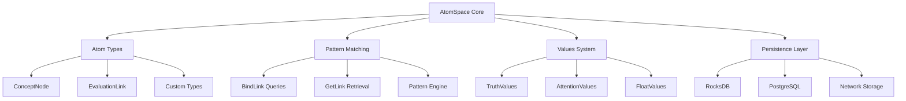
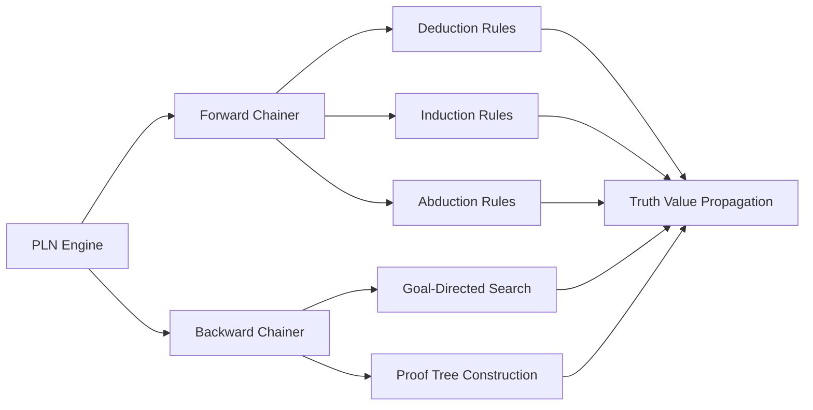
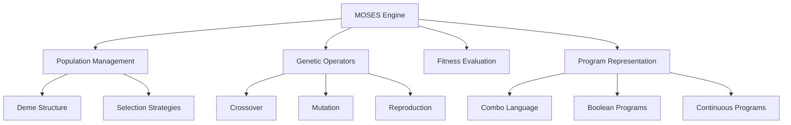
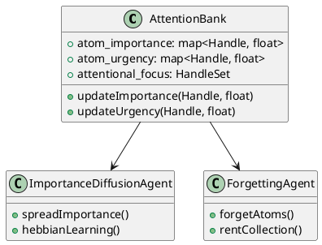
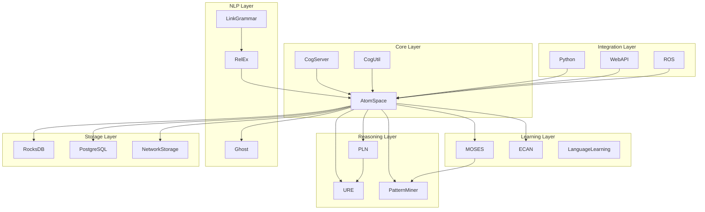

# System Components Overview

## Architecture Overview

OpenCog consists of 100+ interconnected repositories organized into core systems, specialized modules, and integration frameworks. This document provides a comprehensive overview of all major components.

## Core Infrastructure

### 1. AtomSpace - Central Knowledge Store

**Repository**: `atomspace/`
**Status**: ✅ Production Ready
**Language**: C++, Python, Scheme
**Purpose**: Hypergraph database and knowledge representation



**Key Features**:
- Immutable atom creation with mutable values
- Sophisticated pattern matching and queries
- Multiple persistence backends
- Thread-safe concurrent access
- Type system with inheritance

**APIs**:
```cpp
// C++ API
AtomSpace atomspace;
Handle concept = atomspace.add_node(CONCEPT_NODE, "OpenCog");
Handle evaluation = atomspace.add_link(EVALUATION_LINK, 
    {predicate, ListLink({concept, target})});
```

```python
# Python API
from opencog.atomspace import AtomSpace, TruthValue
from opencog.type_constructors import *

atomspace = AtomSpace()
concept = ConceptNode("OpenCog")
evaluation = EvaluationLink(
    PredicateNode("is-a"),
    ListLink(concept, ConceptNode("AGI-System"))
)
```

### 2. CogUtil - Utility Library

**Repository**: `cogutil/`
**Status**: ✅ Production Ready
**Language**: C++
**Purpose**: Core utilities and platform abstractions

**Components**:
- Configuration management
- Logging framework
- Platform abstractions
- Memory management utilities
- Threading primitives
- Performance profiling

### 3. CogServer - Network Service

**Repository**: `cogserver/`
**Status**: ✅ Production Ready
**Language**: C++, Python
**Purpose**: Network-accessible cognitive server

**Features**:
- Multi-client network server
- Scheme and Python shells
- Module loading system
- Command processing
- WebSocket support

```python
# CogServer client example
import socket

client = socket.socket()
client.connect(('localhost', 17001))
client.send(b'(+ 2 3)\n')
response = client.recv(1024)
print(response)  # "5"
```

## Reasoning & Logic Systems

### 4. PLN - Probabilistic Logic Networks

**Repository**: `pln/`
**Status**: 🔄 Active Development
**Language**: Scheme, Python
**Purpose**: Uncertain reasoning and inference



**Rule Examples**:
```scheme
;; Deduction rule
(define deduction-rule
  (BindLink
    (VariableList
      (VariableNode "$A")
      (VariableNode "$B") 
      (VariableNode "$C"))
    (AndLink
      (InheritanceLink (VariableNode "$A") (VariableNode "$B"))
      (InheritanceLink (VariableNode "$B") (VariableNode "$C")))
    (ExecutionOutputLink
      (GroundedSchemaNode "scm: deduction-formula")
      (ListLink
        (InheritanceLink (VariableNode "$A") (VariableNode "$C"))
        (InheritanceLink (VariableNode "$A") (VariableNode "$B"))
        (InheritanceLink (VariableNode "$B") (VariableNode "$C"))))))
```

### 5. URE - Unified Rule Engine

**Repository**: `ure/`
**Status**: ✅ Production Ready
**Language**: C++, Scheme
**Purpose**: Generic rule-based reasoning framework

**Capabilities**:
- Configurable rule sets
- Forward and backward chaining
- Probabilistic inference
- Custom control strategies

### 6. Pattern Miner

**Repository**: `miner/`
**Status**: ✅ Production Ready
**Language**: C++, Scheme
**Purpose**: Frequent pattern discovery in knowledge graphs

**Algorithms**:
- Frequent subgraph mining
- Surprisingness-based pattern ranking
- Incremental pattern discovery
- Distributed mining support

```scheme
;; Pattern mining example
(use-modules (opencog miner))

(cog-mine
  (ConceptNode "knowledge-base")
  #:minsup 10
  #:maximum-iterations 1000
  #:surprisingness 'nisurp)
```

## Learning & Optimization

### 7. MOSES - Evolutionary Learning

**Repository**: `moses/` and `asmoses/`
**Status**: ✅ Production Ready
**Language**: C++, Python
**Purpose**: Program synthesis and feature selection



**Example Usage**:
```python
from opencog.moses import moses

# Define problem
input_table = load_data("training.csv")
target_feature = "target_column"

# Configure MOSES
moses_params = {
    'max_evals': 10000,
    'population_size': 1000,
    'complexity_ratio': 3
}

# Evolve solution
best_program = moses.run(
    input_table=input_table,
    target_feature=target_feature,
    **moses_params
)
```

### 8. Feature Selection

**Repository**: Integrated in `moses/`
**Status**: ✅ Production Ready
**Purpose**: Automated feature selection for ML

**Methods**:
- Univariate feature selection
- Mutual information-based selection
- Incremental feature selection
- Cross-validation integration

## Attention & Control

### 9. ECAN - Economic Attention Networks

**Repository**: `attention/`
**Status**: 🔄 Active Development
**Language**: C++, Python
**Purpose**: Attention allocation and cognitive control



**Components**:
- Attention Value system (Importance/Urgency)
- Importance diffusion algorithms
- Forgetting and rent collection
- Attentional focus management

### 10. Attention Bank

**Integrated with**: ECAN system
**Purpose**: Core attention value storage and management

## Natural Language Processing

### 11. Link Grammar

**Repository**: `link-grammar/`
**Status**: ✅ Production Ready
**Language**: C
**Purpose**: Syntactic parsing of natural language

**Features**:
- Multi-language support (English, Russian, Arabic, etc.)
- Fast parsing algorithms
- Grammatical relationship extraction
- Integration with knowledge representation

### 12. RelEx - Relation Extraction

**Repository**: `relex/`
**Status**: ✅ Production Ready
**Language**: Java
**Purpose**: Semantic relation extraction from parsed text

**Pipeline**:
```
Raw Text → Link Grammar → RelEx → Semantic Relations → AtomSpace
```

### 13. Language Learning

**Repository**: `language-learning/`
**Status**: 🔄 Active Development
**Language**: Python, Scheme
**Purpose**: Unsupervised grammar learning

**Approach**:
- Statistical language acquisition
- Unsupervised grammar induction
- Morphology discovery
- Cross-linguistic analysis

### 14. Ghost - Dialog System

**Repository**: `opencog/` (Ghost module)
**Status**: ✅ Production Ready
**Language**: Scheme
**Purpose**: Rule-based chatbot framework

```scheme
;; Ghost rule example
(ghost-rule
  (topic: introduction)
  (pattern: "hello" "hi" "hey")
  (response: "Hello! Nice to meet you. How can I help?")
  (action: (set-topic general-chat)))
```

## Storage & Persistence

### 15. AtomSpace Storage Backends

#### RocksDB Backend
**Repository**: `atomspace-rocks/`
**Status**: ✅ Production Ready
**Performance**: 100K+ operations/second

#### PostgreSQL Backend  
**Repository**: `atomspace/` (integrated)
**Status**: ✅ Production Ready
**Features**: ACID compliance, SQL queries

#### Network Storage
**Repository**: `atomspace-cog/`
**Status**: 🔄 Active Development
**Purpose**: Distributed AtomSpace over network

#### Experimental Backends
- **DHT Storage**: `atomspace-dht/` - Distributed hash table
- **IPFS Storage**: `atomspace-ipfs/` - Decentralized storage

## Integration & APIs

### 16. Python Bindings

**Repository**: Multiple (Cython-based)
**Status**: ✅ Production Ready
**Coverage**: Full AtomSpace API, most reasoning systems

```python
# Comprehensive Python API
from opencog.atomspace import AtomSpace
from opencog.type_constructors import *
from opencog.bindlink import execute_atom
from opencog.pln import *
from opencog.moses import *
```

### 17. Web Interfaces

#### AtomSpace Explorer
**Repository**: `atomspace-explorer/`
**Status**: 🔄 Active Development
**Technology**: Angular, TypeScript
**Purpose**: Visual AtomSpace browser

#### RESTful API
**Repository**: `atomspace-restful/`
**Status**: 🔄 Active Development
**Features**: HTTP API for AtomSpace operations

#### TypeScript Bindings
**Repository**: `atomspace-typescript/`
**Status**: 🔄 Active Development
**Purpose**: Web-native AtomSpace access

### 18. ROS Integration

**Repository**: `ros-behavior-scripting/`
**Status**: ✅ Production Ready
**Purpose**: Robotics Operating System integration

**Components**:
- Sensor data integration
- Motor control interfaces
- Behavior scripting
- Real-time processing

## Specialized Applications

### 19. Bio-Informatics

**Repository**: `agi-bio/`
**Status**: 🔄 Active Development
**Purpose**: Biological knowledge representation

**Applications**:
- Gene interaction networks
- Protein pathway analysis
- Drug discovery support
- Biomedical reasoning

### 20. Embodied Robotics

#### Perception Systems
**Repository**: `perception/`
**Features**: Face tracking, object recognition

#### Motor Control
**Repository**: `pau2motors/`
**Purpose**: Physical actuation control

#### Blender Integration
**Repository**: `blender_api/`
**Purpose**: 3D animation and visualization

### 21. Virtual Agents

#### Eva Robot
**Repository**: Multiple Eva-related repos
**Purpose**: Humanoid robot personality

#### Loving AI
**Repository**: `loving-ai/`
**Purpose**: Compassionate AI companion

## Development & Testing

### 22. Build & Deployment

#### Docker Containers
**Repository**: `docker/`
**Purpose**: Containerized deployment

#### Package Management
**Repository**: `ocpkg/`
**Purpose**: Dependency management

#### Debian Packages
**Repository**: `opencog-debian/`
**Purpose**: Linux distribution packages

### 23. Testing & Benchmarking

**Repository**: `benchmark/`
**Components**:
- Performance benchmarking
- Memory usage analysis
- Scalability testing
- Regression detection

### 24. Documentation

#### Wiki System
**Repository**: Various `/docs` folders
**Content**: Technical documentation, tutorials

#### Examples
**Repository**: Multiple `/examples` folders
**Coverage**: Code samples, tutorials, demos

## Experimental & Research

### 25. Quantum Computing
**Status**: 🔬 Research Phase
**Purpose**: Quantum-enhanced reasoning

### 26. Distributed Cognition
**Status**: 🔬 Research Phase
**Purpose**: Multi-agent cognitive systems

### 27. Consciousness Modeling
**Status**: 🔬 Research Phase
**Purpose**: Phenomenal consciousness simulation

## Component Interaction Matrix



## Deployment Configurations

### Development Setup
```bash
# Core development stack
sudo apt-get install atomspace cogutil cogserver
pip install opencog
```

### Production Deployment
```yaml
# Docker Compose
version: '3.8'
services:
  cogserver:
    image: opencog/cogserver:latest
    ports:
      - "17001:17001"
    environment:
      - ATOMSPACE_STORAGE=rocksdb
    volumes:
      - ./data:/data
      
  rocksdb:
    image: opencog/rocksdb:latest
    volumes:
      - rocksdb_data:/var/lib/rocksdb
```

### Cloud Native
```yaml
# Kubernetes deployment
apiVersion: apps/v1
kind: Deployment
metadata:
  name: opencog-cluster
spec:
  replicas: 3
  template:
    spec:
      containers:
      - name: cogserver
        image: opencog/cogserver:latest
        resources:
          requests:
            memory: "4Gi"
            cpu: "2"
```

## Integration Patterns

### Microservices Architecture
- **AtomSpace Service**: Core knowledge storage
- **Reasoning Service**: PLN and URE processing  
- **Learning Service**: MOSES and pattern mining
- **NLP Service**: Language processing pipeline
- **API Gateway**: Unified external interface

### Event-Driven Architecture
- **Atom Events**: Creation, modification, deletion
- **Attention Events**: Importance/urgency changes
- **Inference Events**: New conclusions derived
- **Learning Events**: Pattern discoveries

### Plugin Architecture
- **Loadable Modules**: Dynamic capability extension
- **Rule Sets**: Pluggable reasoning rules
- **Storage Backends**: Swappable persistence layers
- **Language Bindings**: Multi-language support

## Performance Characteristics

| Component | Throughput | Latency | Memory |
|-----------|------------|---------|--------|
| AtomSpace | 100K ops/sec | <1ms | 1GB/1M atoms |
| PLN | 1K inferences/sec | 10ms | Variable |
| MOSES | 1K evals/sec | Variable | 2-8GB |
| Pattern Miner | 100 patterns/sec | 1s | 4-16GB |
| CogServer | 1K requests/sec | 5ms | 100MB base |

## Next Steps

### Component Priorities

**High Priority**:
1. AtomSpace performance optimization
2. PLN reasoning completeness
3. Modern web API development
4. AI/ML integration framework

**Medium Priority**:
1. ECAN attention enhancement
2. Language learning improvements
3. Distributed storage implementation
4. Cloud-native architecture

**Research Priority**:
1. Consciousness modeling framework
2. Quantum computing integration
3. Advanced embodiment capabilities
4. Meta-cognitive architectures

This comprehensive component overview provides the foundation for understanding OpenCog's architecture and planning future development efforts.
