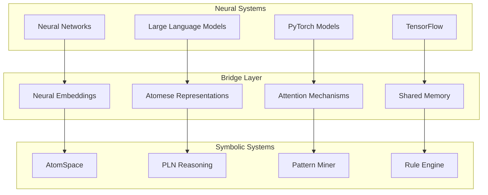

# AI/ML Integration

## Overview

OpenCog provides comprehensive integration with modern AI/ML frameworks, bridging neural and symbolic approaches through multiple pathways and interfaces.

## Neural-Symbolic Integration

### Architecture Overview



### Key Integration Points

1. **Neural Embeddings to AtomSpace**
   - Vector representations mapped to Atoms
   - Semantic similarity preservation
   - Dynamic embedding updates

2. **LLM to Atomese Translation**
   - Natural language to formal logic
   - Automated knowledge extraction
   - Reasoning chain generation

3. **Attention Mechanisms**
   - Neural attention weights → Atom importance
   - Focus of attention synchronization
   - Cognitive load balancing

## Large Language Model Integration

### Current Implementations

| Framework | Status | Integration Type | Use Case |
|-----------|--------|------------------|----------|
| KoboldCpp | ✅ Active | Direct API | Text generation, reasoning |
| ChatRWKV | ✅ Active | Python binding | Memory-efficient processing |
| llama.cpp | ✅ Active | C++ integration | Local inference |
| Custom LLM-C | 🔄 Development | OpenCog native | Cognitive reasoning |

### KoboldCpp Integration

Located in: `3p/koboldcpp/`

```python
# KoboldCpp AtomSpace Bridge
from opencog.atomspace import AtomSpace, TruthValue
from opencog.type_constructors import *

class KoboldCogBridge:
    def __init__(self, kobold_url="http://localhost:5001"):
        self.atomspace = AtomSpace()
        self.kobold_url = kobold_url
        
    def process_cognitive_query(self, query):
        # Convert AtomSpace query to natural language
        nl_query = self.atomese_to_natural_language(query)
        
        # Send to KoboldCpp
        response = self.send_to_kobold(nl_query)
        
        # Parse response back to Atomese
        atoms = self.natural_language_to_atomese(response)
        
        return atoms
```

### RWKV Integration

Located in: `3p/chatrwkv/`

```python
# RWKV Cognitive Processing
class RWKVCognitiveProcessor:
    def __init__(self):
        self.model = RWKV_RNN()
        self.atomspace = AtomSpace()
        
    def process_sequence(self, atom_sequence):
        # Convert atoms to token sequence
        tokens = self.atoms_to_tokens(atom_sequence)
        
        # Process with RWKV
        state = self.model.init_state()
        outputs = []
        
        for token in tokens:
            logits, state = self.model.forward(token, state)
            outputs.append(logits)
            
        # Convert back to cognitive structures
        return self.tokens_to_cognitive_atoms(outputs)
```

## PyTorch Integration

### Neural-Symbolic Modules

```python
# Located in: nn/
import torch
import torch.nn as nn
from opencog.atomspace import AtomSpace
from opencog.type_constructors import *

class CognitiveAttentionLayer(nn.Module):
    def __init__(self, d_model, atomspace):
        super().__init__()
        self.d_model = d_model
        self.atomspace = atomspace
        self.attention = nn.MultiheadAttention(d_model, 8)
        
    def forward(self, x, atom_context=None):
        # Standard attention
        attn_output, attn_weights = self.attention(x, x, x)
        
        # Update AtomSpace attention values
        if atom_context:
            self.update_atom_attention(attn_weights, atom_context)
            
        return attn_output
    
    def update_atom_attention(self, weights, atoms):
        for i, atom in enumerate(atoms):
            importance = float(weights[i].mean())
            atom.set_av(AttentionValue(importance, 0))
```

## Cognitive Reasoning Integration

### PLN-Neural Hybrid

```scheme
;; PLN with Neural Confidence
(define pln-neural-rule
  (BindLink
    (VariableList
      (Variable "$X")
      (Variable "$Y"))
    (AndLink
      (Inheritance (Variable "$X") (Variable "$Y"))
      (Evaluation
        (Predicate "neural-confidence")
        (List (Variable "$X") (Variable "$Y"))))
    (ExecutionOutput
      (GroundedSchema "scm: neural-enhanced-inheritance")
      (List (Variable "$X") (Variable "$Y")))))
```

### MOSES-Neural Evolution

```cpp
// Located in: asmoses/
#include <torch/torch.h>
#include <opencog/asmoses/combo/combo/combo.h>

class NeuralMOSES {
public:
    NeuralMOSES(torch::Device device = torch::kCPU) 
        : device_(device) {
        // Initialize neural scoring network
        scorer_ = torch::nn::Sequential(
            torch::nn::Linear(input_size, 128),
            torch::nn::ReLU(),
            torch::nn::Linear(128, 1),
            torch::nn::Sigmoid()
        );
    }
    
    fitness_t neural_score(const combo_tree& tree) {
        // Convert combo tree to neural input
        auto input = tree_to_tensor(tree);
        
        // Score with neural network
        auto output = scorer_->forward(input);
        return output.item<double>();
    }
    
private:
    torch::Device device_;
    torch::nn::Sequential scorer_;
};
```

## Practical Applications

### 1. SkinTwin System

Located in: `agi-skintwin/`

Combines:
- Neural networks for biological modeling
- Symbolic reasoning for chemical interactions
- Pattern mining for ingredient analysis
- MOSES for formulation optimization

### 2. Cognitive Dialog Systems

Located in: `opencog/nlp/chatbot/`

Features:
- LLM-powered response generation
- Symbolic reasoning for context
- Neural embeddings for similarity
- Pattern mining for conversation analysis

### 3. Biological Research

Located in: `agi-bio/`

Integrates:
- Neural networks for gene expression
- Symbolic knowledge graphs
- PLN reasoning for hypothesis generation
- MOSES for model evolution

## Development Guidelines

### Adding Neural Components

1. **Create Bridge Interface**
   ```python
   class NeuralAtomSpaceBridge:
       def __init__(self, atomspace, model):
           self.atomspace = atomspace
           self.model = model
   ```

2. **Implement Bidirectional Translation**
   ```python
   def atoms_to_neural(self, atoms):
       # Convert atoms to neural input
       pass
       
   def neural_to_atoms(self, neural_output):
       # Convert neural output to atoms
       pass
   ```

3. **Synchronize Attention Mechanisms**
   ```python
   def sync_attention(self, neural_attention, atom_attention):
       # Keep attention systems aligned
       pass
   ```

### Performance Optimization

1. **Batch Processing**
   - Group similar operations
   - Vectorize when possible
   - Cache frequently used patterns

2. **Memory Management**
   - Share embeddings between systems
   - Implement lazy loading
   - Use attention-based pruning

3. **Parallel Processing**
   - Separate neural and symbolic threads
   - Asynchronous communication
   - Load balancing

## Future Directions

### Quantum-Neural Integration
- Quantum computing backends
- Quantum attention mechanisms
- Hybrid classical-quantum reasoning

### Meta-Learning Systems
- Learning to learn architectures
- Adaptive neural-symbolic bridges
- Self-modifying cognitive systems

### Large-Scale Deployment
- Distributed neural-symbolic processing
- Cloud-native architectures
- Edge computing integration

## Next Steps

1. **Immediate (0-3 months)**
   - [ ] Enhanced LLM integration
   - [ ] Neural attention synchronization
   - [ ] Pattern-neural bridges

2. **Short-term (3-6 months)**
   - [ ] Multi-modal processing
   - [ ] Advanced embedding techniques
   - [ ] Real-time learning systems

3. **Long-term (6+ months)**
   - [ ] Consciousness modeling integration
   - [ ] Meta-cognitive architectures
   - [ ] AGI milestone achievements
