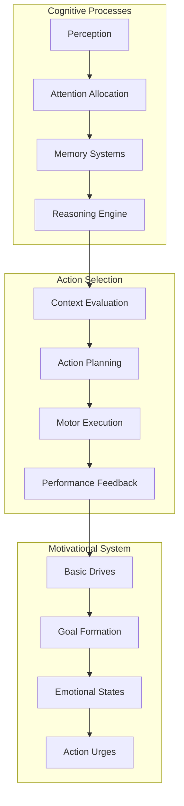
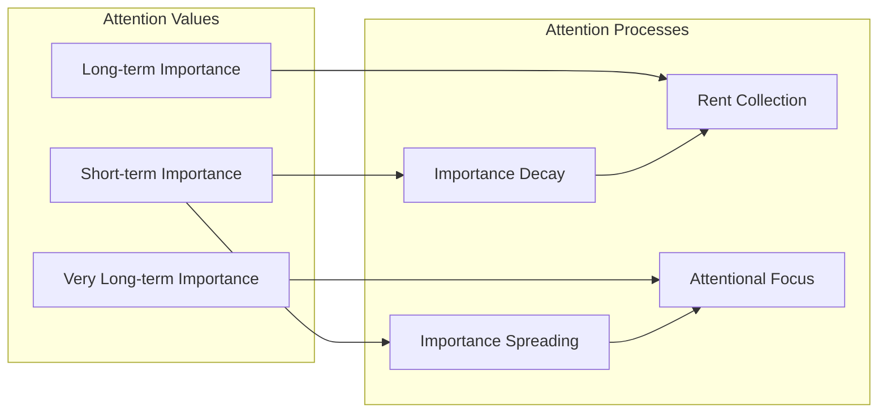
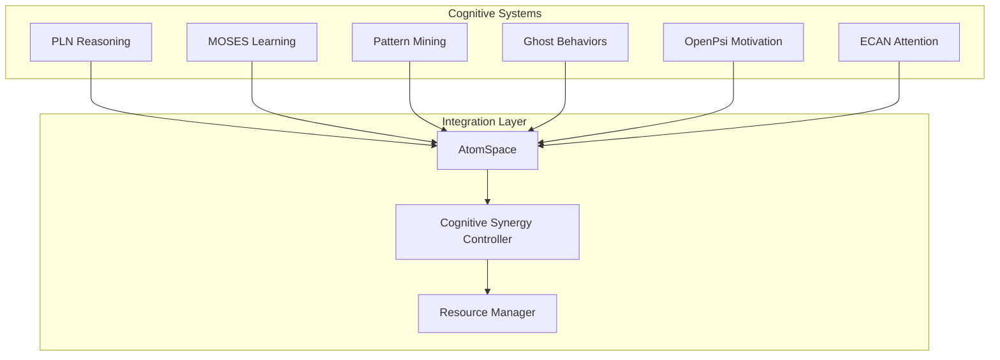
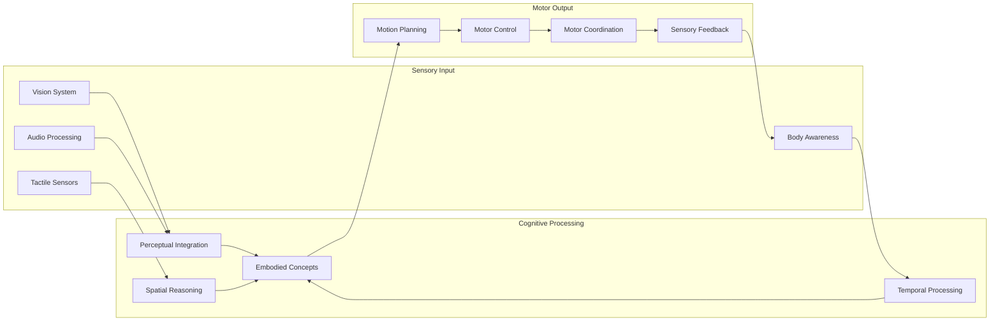

# Cognitive Architectures

## Overview

OpenCog implements multiple cognitive architectures that work together to provide advanced reasoning, learning, and adaptive behavior capabilities.

## OpenPsi Framework

### Architecture Overview



### Core Components

#### Drive System

Located in: `opencog/openpsi/`

```scheme
;; Basic drives implementation
(define-public physiological-drives
  (list
    (psi-drive "food" 0.8)
    (psi-drive "water" 0.9)
    (psi-drive "rest" 0.3)
    (psi-drive "social" 0.6)))

;; Goal formation from drives
(define (form-goals drives)
  (map (lambda (drive)
    (psi-goal (psi-drive-name drive)
              (psi-drive-strength drive)
              (get-time)))
    drives))
```

#### Emotional Processing

```cpp
// Located in: opencog/openpsi/
#include <opencog/atoms/base/Atom.h>
#include <opencog/atoms/base/Node.h>

class EmotionalState {
public:
    EmotionalState(const std::string& emotion, double intensity) 
        : emotion_name_(emotion), intensity_(intensity) {}
    
    void update_intensity(double new_intensity) {
        intensity_ = std::max(0.0, std::min(1.0, new_intensity));
    }
    
    double get_arousal() const {
        return intensity_ * arousal_factor_;
    }
    
    Handle to_atomese(AtomSpace& as) const {
        return as.add_link(EVALUATION_LINK,
            as.add_node(PREDICATE_NODE, emotion_name_),
            as.add_node(NUMBER_NODE, std::to_string(intensity_)));
    }
    
private:
    std::string emotion_name_;
    double intensity_;
    double arousal_factor_ = 0.7;
};
```

## ECAN (Economic Attention Networks)

### Attention Dynamics

Located in: `attention/`



#### Attention Value Management

```cpp
// Located in: attention/opencog/attentionbank/
class AttentionValue {
public:
    AttentionValue(double sti = 0.0, double lti = 0.0, double vlti = 0.0)
        : short_term_importance_(sti)
        , long_term_importance_(lti)
        , very_long_term_importance_(vlti) {}
    
    void spread_importance(const HandleSeq& neighbors, double spread_rate) {
        double amount_to_spread = short_term_importance_ * spread_rate;
        double per_neighbor = amount_to_spread / neighbors.size();
        
        for (const Handle& neighbor : neighbors) {
            neighbor->get_av()->change_sti(per_neighbor);
        }
        
        change_sti(-amount_to_spread);
    }
    
    void collect_rent(double rent_rate) {
        double rent = short_term_importance_ * rent_rate;
        change_sti(-rent);
        
        // Transfer to long-term importance
        change_lti(rent * 0.1);
    }
    
private:
    double short_term_importance_;
    double long_term_importance_;
    double very_long_term_importance_;
};
```

## Ghost Behavior Engine

### Behavior Tree Implementation

Located in: `opencog/ghost/`

```scheme
;; Ghost rule definition
(define-public (ghost-rule context action)
  (bind-link
    (variable-list $context-vars)
    (and-link
      (evaluation-link
        (predicate-node "context-satisfied")
        (list-link $context-vars))
      context)
    (execution-output-link
      (grounded-schema-node "scm: execute-action")
      (list-link action))))

;; Example behavior rule
(ghost-rule
  ;; Context: user asks question
  (and-link
    (state-link
      (anchor-node "current-interaction")
      (concept-node "question-asked"))
    (evaluation-link
      (predicate-node "topic")
      (list-link
        (variable-node "$question")
        (concept-node "science"))))
  ;; Action: provide scientific answer
  (execution-output-link
    (grounded-schema-node "scm: generate-scientific-response")
    (variable-node "$question")))
```

### Dynamic Behavior Adaptation

```python
# Located in: opencog/ghost/procedures/
class BehaviorAdaptation:
    def __init__(self, atomspace):
        self.atomspace = atomspace
        self.performance_history = []
        
    def adapt_behavior(self, context, action, outcome):
        """Adapt behavior based on performance feedback"""
        success_rate = self.calculate_success_rate(action)
        
        if success_rate < 0.3:
            # Low success rate - modify behavior
            self.modify_action_parameters(action, context)
        elif success_rate > 0.8:
            # High success rate - reinforce behavior
            self.reinforce_behavior(action, context)
            
        self.performance_history.append({
            'context': context,
            'action': action,
            'outcome': outcome,
            'timestamp': time.time()
        })
    
    def modify_action_parameters(self, action, context):
        """Modify action parameters for better performance"""
        # Implement parameter adjustment logic
        pass
```

## Cognitive Synergy Architecture

### Multi-System Integration



### Synergy Controller Implementation

```cpp
// Located in: opencog/
class CognitiveSynergyController {
public:
    CognitiveSynergyController(AtomSpace& atomspace) 
        : atomspace_(atomspace) {
        initialize_cognitive_systems();
    }
    
    void cognitive_cycle() {
        // 1. Perception and attention
        update_attention_allocation();
        
        // 2. Pattern recognition and learning
        run_pattern_mining();
        
        // 3. Reasoning and planning
        execute_reasoning_cycle();
        
        // 4. Goal formation and action selection
        update_motivational_state();
        
        // 5. Behavior execution
        execute_selected_actions();
        
        // 6. Performance feedback
        process_feedback_loop();
    }
    
private:
    AtomSpace& atomspace_;
    std::unique_ptr<PLNReasoner> pln_reasoner_;
    std::unique_ptr<MOSESLearner> moses_learner_;
    std::unique_ptr<PatternMiner> pattern_miner_;
    std::unique_ptr<GhostBehaviorEngine> ghost_engine_;
    std::unique_ptr<OpenPsiMotivation> openpsi_system_;
    std::unique_ptr<ECANAttention> ecan_system_;
    
    void initialize_cognitive_systems() {
        pln_reasoner_ = std::make_unique<PLNReasoner>(atomspace_);
        moses_learner_ = std::make_unique<MOSESLearner>(atomspace_);
        pattern_miner_ = std::make_unique<PatternMiner>(atomspace_);
        ghost_engine_ = std::make_unique<GhostBehaviorEngine>(atomspace_);
        openpsi_system_ = std::make_unique<OpenPsiMotivation>(atomspace_);
        ecan_system_ = std::make_unique<ECANAttention>(atomspace_);
    }
};
```

## Embodied Cognition Integration

### Sensorimotor Integration

Located in: `ros-behavior-scripting/`



### ROS Integration Framework

```python
# Located in: ros-behavior-scripting/sensors/
import rospy
from opencog.atomspace import AtomSpace
from opencog.type_constructors import *

class SensorMotorIntegration:
    def __init__(self):
        self.atomspace = AtomSpace()
        rospy.init_node('cognitive_embodiment')
        
        # Sensor subscribers
        self.vision_sub = rospy.Subscriber('/camera/image', Image, self.vision_callback)
        self.audio_sub = rospy.Subscriber('/audio/power', Float32, self.audio_callback)
        
        # Motor publishers
        self.movement_pub = rospy.Publisher('/robot/movement', Twist, queue_size=10)
        self.expression_pub = rospy.Publisher('/robot/expression', String, queue_size=10)
        
    def vision_callback(self, image_msg):
        """Process visual input and update AtomSpace"""
        visual_features = self.extract_visual_features(image_msg)
        
        for feature in visual_features:
            self.atomspace.add_link(EVALUATION_LINK,
                PredicateNode("visual-feature"),
                ListLink(
                    ConceptNode(feature['type']),
                    NumberNode(str(feature['confidence']))))
    
    def audio_callback(self, audio_msg):
        """Process audio input and update AtomSpace"""
        audio_level = audio_msg.data
        
        self.atomspace.add_link(STATE_LINK,
            AnchorNode("audio-level"),
            NumberNode(str(audio_level)))
    
    def execute_motor_action(self, action_atom):
        """Execute motor actions based on AtomSpace decisions"""
        action_type = action_atom.out[0].name
        
        if action_type == "move":
            self.execute_movement(action_atom)
        elif action_type == "express":
            self.execute_expression(action_atom)
```

## Next Steps

### Current Implementations
- [x] OpenPsi motivational framework
- [x] ECAN attention dynamics
- [x] Ghost behavior engine
- [x] Basic cognitive synergy
- [x] ROS sensorimotor integration

### Planned Enhancements
- [ ] Advanced meta-cognitive monitoring
- [ ] Self-reflective reasoning capabilities
- [ ] Dynamic architecture reconfiguration
- [ ] Multi-agent cognitive coordination
- [ ] Quantum-cognitive hybrid processing

### Integration Priorities
1. Enhanced PLN-Ghost integration
2. MOSES-ECAN synergy optimization
3. Pattern mining for behavior adaptation
4. Real-time cognitive load balancing
5. Embodied concept formation
