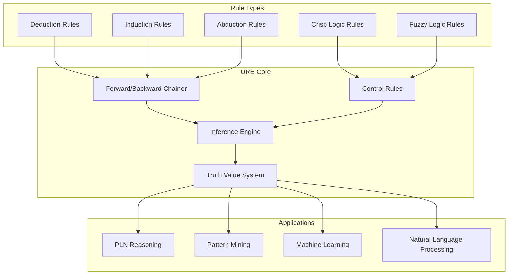
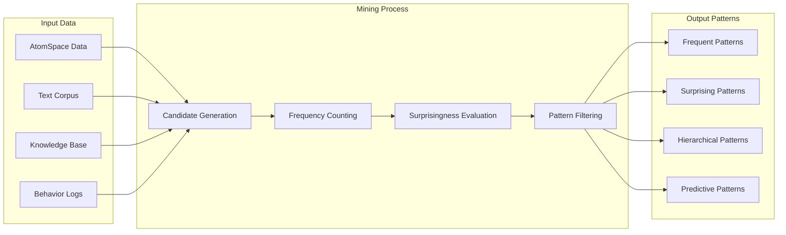
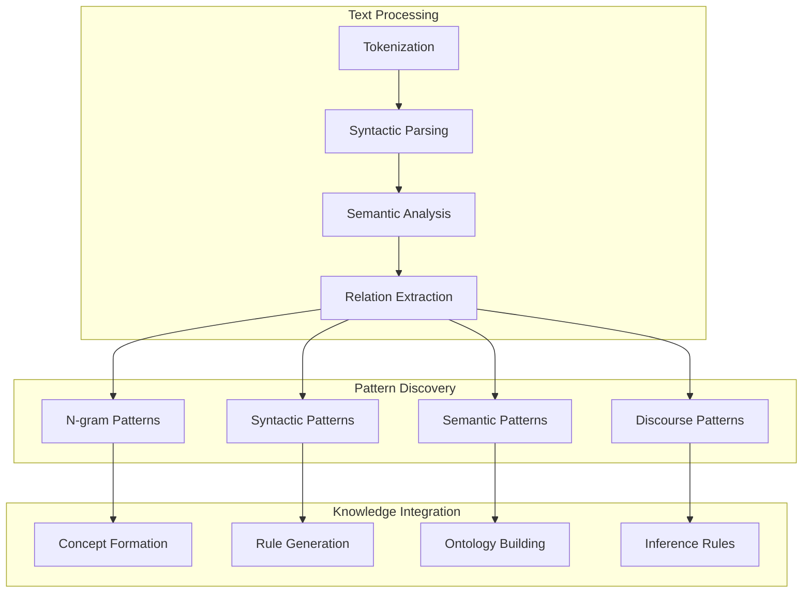

# Pattern Mining Systems

## Overview

OpenCog's pattern mining capabilities provide automated discovery of meaningful patterns in data, supporting learning, reasoning, and knowledge extraction across multiple domains.

## Unified Rule Engine (URE)

### Architecture Overview



### Core Implementation

Located in: `ure/`

```cpp
// URE Chainer Implementation
#include <opencog/ure/ChainerUtils.h>
#include <opencog/ure/Rule.h>

class UnifiedRuleEngine {
public:
    UnifiedRuleEngine(AtomSpace& atomspace) : as_(atomspace) {
        initialize_rule_base();
    }
    
    HandleSeq forward_chain(const Handle& source, 
                           const Handle& rule_base,
                           int max_iterations = 100) {
        HandleSeq results;
        
        for (int i = 0; i < max_iterations; ++i) {
            HandleSeq new_results = apply_forward_rules(source, rule_base);
            
            if (new_results.empty()) break;
            
            results.insert(results.end(), 
                          new_results.begin(), 
                          new_results.end());
        }
        
        return results;
    }
    
    Handle backward_chain(const Handle& target,
                         const Handle& rule_base,
                         int max_iterations = 100) {
        return search_for_proof(target, rule_base, max_iterations);
    }
    
private:
    AtomSpace& as_;
    HandleSeq rule_base_;
    
    void initialize_rule_base() {
        // Load standard inference rules
        load_deduction_rules();
        load_induction_rules();
        load_abduction_rules();
    }
    
    HandleSeq apply_forward_rules(const Handle& source, 
                                 const Handle& rule_base) {
        HandleSeq results;
        
        for (const Handle& rule : get_applicable_rules(source, rule_base)) {
            Handle result = apply_rule(rule, source);
            if (result != Handle::UNDEFINED) {
                results.push_back(result);
            }
        }
        
        return results;
    }
};
```

## Pattern Miner

### Mining Algorithm

Located in: `miner/`



### Implementation

```cpp
// Located in: miner/opencog/miner/
class PatternMiner {
public:
    PatternMiner(AtomSpace& atomspace) : as_(atomspace) {
        configure_mining_parameters();
    }
    
    HandleSeq mine_patterns(const HandleSeq& dataset,
                           unsigned int minimum_support = 2,
                           double minimum_surprisingness = 0.1) {
        HandleSeq patterns;
        
        // Generate candidate patterns
        HandleSeq candidates = generate_candidates(dataset);
        
        // Evaluate each candidate
        for (const Handle& candidate : candidates) {
            PatternStats stats = evaluate_pattern(candidate, dataset);
            
            if (stats.support >= minimum_support &&
                stats.surprisingness >= minimum_surprisingness) {
                patterns.push_back(candidate);
            }
        }
        
        // Sort by interestingness
        std::sort(patterns.begin(), patterns.end(),
                 [this](const Handle& a, const Handle& b) {
                     return calculate_interestingness(a) > 
                            calculate_interestingness(b);
                 });
        
        return patterns;
    }
    
private:
    AtomSpace& as_;
    MiningParameters params_;
    
    struct PatternStats {
        unsigned int support;
        double frequency;
        double surprisingness;
        double interestingness;
    };
    
    PatternStats evaluate_pattern(const Handle& pattern,
                                 const HandleSeq& dataset) {
        PatternStats stats;
        
        // Count pattern occurrences
        stats.support = count_pattern_support(pattern, dataset);
        stats.frequency = static_cast<double>(stats.support) / dataset.size();
        
        // Calculate surprisingness
        stats.surprisingness = calculate_surprisingness(pattern, dataset);
        
        // Calculate overall interestingness
        stats.interestingness = stats.frequency * stats.surprisingness;
        
        return stats;
    }
    
    double calculate_surprisingness(const Handle& pattern,
                                   const HandleSeq& dataset) {
        // I(P) = P(P) * log2(P(P) / P_I(P))
        // where P_I(P) is the independence assumption probability
        
        double actual_prob = calculate_actual_probability(pattern, dataset);
        double independence_prob = calculate_independence_probability(pattern, dataset);
        
        if (independence_prob == 0.0) return 0.0;
        
        return actual_prob * log2(actual_prob / independence_prob);
    }
};
```

## Temporal Pattern Mining

### Sequence Analysis

```python
# Located in: learn/scm/
class TemporalPatternMiner:
    def __init__(self, atomspace):
        self.atomspace = atomspace
        self.temporal_window = 10  # seconds
        
    def mine_temporal_patterns(self, event_sequence):
        """Mine patterns from temporal event sequences"""
        patterns = []
        
        # Extract temporal windows
        windows = self.extract_temporal_windows(event_sequence)
        
        for window in windows:
            # Find frequent subsequences
            frequent_seqs = self.find_frequent_subsequences(window)
            
            # Identify causal relationships
            causal_patterns = self.identify_causal_patterns(frequent_seqs)
            
            patterns.extend(causal_patterns)
        
        return self.rank_temporal_patterns(patterns)
    
    def extract_temporal_windows(self, event_sequence):
        """Extract overlapping temporal windows"""
        windows = []
        window_size = self.temporal_window
        
        for i in range(0, len(event_sequence) - window_size + 1):
            window = event_sequence[i:i + window_size]
            windows.append(window)
        
        return windows
    
    def identify_causal_patterns(self, sequences):
        """Identify potential causal relationships"""
        causal_patterns = []
        
        for seq in sequences:
            for i in range(len(seq) - 1):
                antecedent = seq[i]
                consequent = seq[i + 1]
                
                # Calculate temporal correlation
                correlation = self.calculate_temporal_correlation(
                    antecedent, consequent)
                
                if correlation > 0.7:  # threshold
                    causal_pattern = self.create_causal_pattern(
                        antecedent, consequent, correlation)
                    causal_patterns.append(causal_pattern)
        
        return causal_patterns
    
    def create_causal_pattern(self, antecedent, consequent, strength):
        """Create causal pattern in AtomSpace"""
        return self.atomspace.add_link(PREDICTIVE_IMPLICATION_LINK,
            antecedent,
            consequent,
            TruthValue(strength, 0.9))
```

## Concept Formation

### Hierarchical Clustering

```scheme
;; Located in: learn/scm/gram-class/
(define-public (form-concepts atom-set similarity-threshold)
  "Form hierarchical concepts from similar atoms"
  (define clusters (agglomerative-cluster atom-set similarity-threshold))
  
  (map (lambda (cluster)
    (let* ((concept-name (generate-concept-name cluster))
           (concept-node (Concept concept-name))
           (member-links (map (lambda (member)
                               (Member member concept-node))
                             cluster)))
      (cons concept-node member-links)))
    clusters))

(define (agglomerative-cluster atoms threshold)
  "Perform agglomerative clustering"
  (define initial-clusters (map list atoms))
  (define current-clusters initial-clusters)
  
  (while (and (> (length current-clusters) 1)
              (> (find-max-similarity current-clusters) threshold))
    (let* ((closest-pair (find-closest-clusters current-clusters))
           (merged-cluster (merge-clusters 
                           (first closest-pair) 
                           (second closest-pair))))
      (set! current-clusters 
        (cons merged-cluster 
              (remove-clusters current-clusters closest-pair)))))
  
  current-clusters)

(define (calculate-concept-similarity concept1 concept2)
  "Calculate similarity between two concepts"
  (let* ((members1 (get-concept-members concept1))
         (members2 (get-concept-members concept2))
         (intersection (length (lset-intersection equal? members1 members2)))
         (union (length (lset-union equal? members1 members2))))
    (/ intersection union)))
```

## Natural Language Pattern Mining

### Linguistic Pattern Extraction

Located in: `learn/`



### Implementation

```python
# Located in: learn/scm/
class LinguisticPatternMiner:
    def __init__(self, atomspace):
        self.atomspace = atomspace
        self.link_grammar_parser = LinkGrammarParser()
        
    def mine_linguistic_patterns(self, text_corpus):
        """Extract linguistic patterns from text corpus"""
        patterns = {
            'syntactic': [],
            'semantic': [],
            'lexical': [],
            'discourse': []
        }
        
        for text in text_corpus:
            # Parse text into link-grammar structures
            parses = self.link_grammar_parser.parse(text)
            
            # Extract different types of patterns
            patterns['syntactic'].extend(
                self.extract_syntactic_patterns(parses))
            patterns['semantic'].extend(
                self.extract_semantic_patterns(parses))
            patterns['lexical'].extend(
                self.extract_lexical_patterns(parses))
            patterns['discourse'].extend(
                self.extract_discourse_patterns(parses))
        
        # Convert patterns to AtomSpace representation
        return self.patterns_to_atomspace(patterns)
    
    def extract_syntactic_patterns(self, parses):
        """Extract syntactic patterns from link-grammar parses"""
        patterns = []
        
        for parse in parses:
            # Extract frequent link combinations
            link_sequences = self.get_link_sequences(parse)
            
            for seq in link_sequences:
                if len(seq) >= 2:  # minimum pattern length
                    pattern = {
                        'type': 'syntactic',
                        'structure': seq,
                        'frequency': self.count_pattern_frequency(seq),
                        'confidence': self.calculate_pattern_confidence(seq)
                    }
                    patterns.append(pattern)
        
        return patterns
    
    def patterns_to_atomspace(self, patterns):
        """Convert discovered patterns to AtomSpace atoms"""
        atomspace_patterns = []
        
        for pattern_type, pattern_list in patterns.items():
            for pattern in pattern_list:
                # Create pattern atom
                pattern_atom = self.atomspace.add_link(EVALUATION_LINK,
                    PredicateNode(f"{pattern_type}_pattern"),
                    ListLink(*[ConceptNode(str(element)) 
                              for element in pattern['structure']]),
                    TruthValue(pattern['confidence'], 0.8))
                
                atomspace_patterns.append(pattern_atom)
        
        return atomspace_patterns
```

## Next Steps

### Current Capabilities
- [x] Unified Rule Engine framework
- [x] Frequent pattern mining
- [x] Temporal pattern discovery
- [x] Concept formation algorithms
- [x] Linguistic pattern extraction

### Planned Enhancements
- [ ] Quantum pattern mining algorithms
- [ ] Multi-modal pattern integration
- [ ] Real-time pattern streaming
- [ ] Federated pattern mining
- [ ] Causal pattern discovery

### Integration Goals
1. PLN-pattern mining synergy
2. MOSES-driven pattern evolution
3. Real-time behavioral pattern adaptation
4. Cross-modal pattern correlation
5. Distributed pattern mining networks
